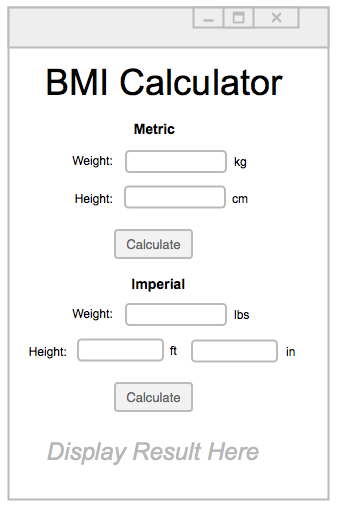

# BMI-Calculator
A program to calculate a the Body Mass Index (BMI), given a weight and height in either metric or imperial measurements.

You must complete the assignment based on the UI Mock Up image. When either button is pressed the calculated BMI value should appear at the bottom of the application window.

Add a stylesheet to create an attractive application.

If you have everything working (and some extra time left):

- Add a transition when the BMI value is displayed (e.g. `FadeTransition` or `TranslateTransition`)
- If a metric calculation is made, fill in the imperial `TextField`s with their equivalent values
- If an imperial calculation is made, fill in the metric `TexField`s with their equivalent values
- Add an image (using an `ImageView`)
